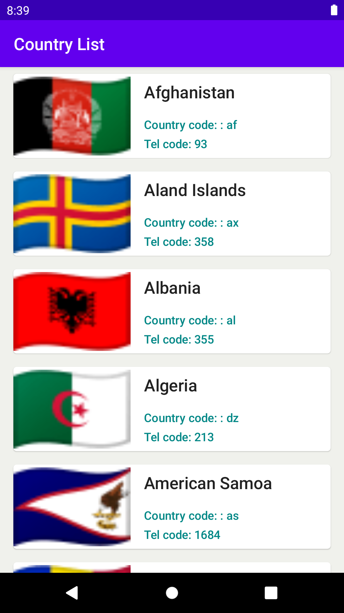
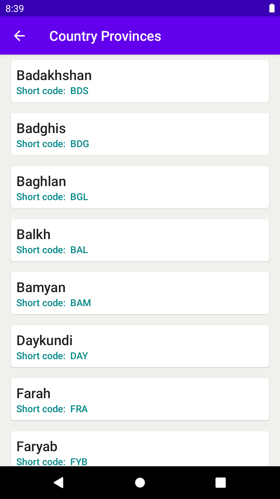

## country-list

Android app displays Countries and Provinces.

## Project Setup

- Import project in Android Studio
- Run app module in Android Studio
- Or to run via command line ```./gradlew :app:installDebug```

## Features

### Country List Screen

- Loads and displays the list of countries from the API
- Shows loading state
- Shows error -state
- Survives Config Changes
- displays country flag
- Selecting a Country launches the Country Details Screen.

### Country Details Screen

- Loads and displays list of provinces from the previously selected country.
- Shows loading state
- Shows error state
- Shows empty state
- Survives Config Changes

### Screen shots

#### List Screen



### Details Screen



